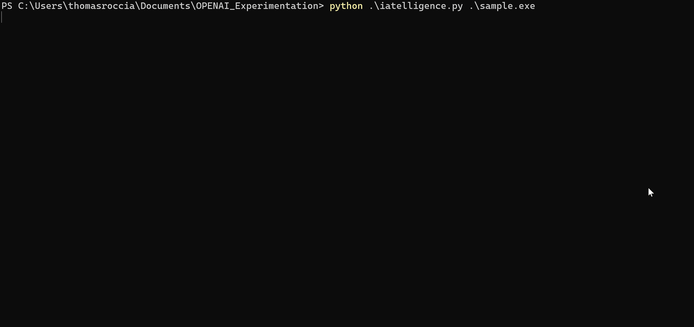

# IATElligence
IATelligence is a Python script that extracts the Import Address Table (IAT) from a PE file and uses OpenAI's GPT-3 model to provide details about each Windows API imported by the file. The script also searches for related MITRE ATT&CK techniques and explains how the API could potentially be used by attackers. 

It also displays the hashes of the file and estimates the cost of the GPT-3 requests. IATelligence is a proof of concept for using GPT-3 for malware analysis and quickly assessing the behavior of a malware based on its IAT.

Below is a quick example of the result you'll get. Notice that the request can take longer depending of the size of the IAT. 



# Getting Started

## Prerequisites

To run this tool you will need an access to the [OpenAi API](https://beta.openai.com/), you will then need to modify the script to add your own API. 

```python
# Authenticate with the OpenAI API
openai.api_key = ""
```

You will also need to install the requirements.

```
pip install -r requirements.txt
```

# Usage

To run the tool just simply specify a PE file as argument to the script. 

```
python iatelligence.py sample.exe
```

The script will also calculate the hashes as well as the estimated cost of the request. 

```
[+] IAT Request from the file: .\sample.exe
[+] 33 functions will be requested to GPT!
[+] MD5: 2f82623f9523c0d167862cad0eff6806
[+] SHA1: 5d77804b87735e66d7d1e263c31c4ef010f16153
[+] SHA256: 9c2c8a8588fe6db09c09337e78437cb056cd557db1bcf5240112cbfb7b600efb
[+] Imphash: 8eeaa9499666119d13b3f44ecd77a729
[!] Estimated cost of requests: $0.0693
```

The result can be visualize in a table. Below is a truncated extract.

```
+------------------------------------------+-----------------------------+------------------------------------------+
| Libraries                                | API                         | GPT Verdict                              |
+------------------------------------------+-----------------------------+------------------------------------------+
| SHELL32.dll                              | ShellExecuteW               | The purpose of this API, ShellExecuteW,  |
|                                          |                             | is to launch an application or open a    |
|                                          |                             | file in the Windows operating system. It |
|                                          |                             | is associated with MITRE ATT&CK          |
|                                          |                             | technique T1218 - Execution Through      |
|                                          |                             | Module Load. This technique involves     |
|                                          |                             | using shell32.dll to execute malicious   |
|                                          |                             | code without directly invoking the       |
|                                          |                             | executable file itself, which can help   |
|                                          |                             | attackers evade detection and gain       |
|                                          |                             | access to systems.                       |
|                                          |                             |                                          |
| KERNEL32.dll                             | GetCurrentThreadId          | The purpose of this API is to retrieve   |
|                                          |                             | the identifier of the calling thread. It |
|                                          |                             | is associated with MITRE ATT&CK          |
|                                          |                             | technique T1155 - Thread Execution,      |
|                                          |                             | which involves creating and running      |
|                                          |                             | threads within a process or code         |
|                                          |                             | injection into an existing thread. The   |
|                                          |                             | GetCurrentThreadId() function allows     |
|                                          |                             | attackers to identify and target         |
|                                          |                             | specific threads for malicious           |
|                                          |                             | activities.                              |
|                                          |                             |                                          |
| KERNEL32.dll                             | GetSystemTimeAsFileTime     | The purpose of this API is to retrieve   |
|                                          |                             | the current system time as a file time   |
|                                          |                             | format. It is associated with the MITRE  |
|                                          |                             | ATT&CK technique T1124 - System Time     |
|                                          |                             | Discovery, which is used by adversaries  |
|                                          |                             | to gain insight into when certain        |
|                                          |                             | activities occurred or are scheduled to  |
|                                          |                             | occur. This allows them to perform       |
|                                          |                             | timing-based attacks and evade           |
|                                          |                             | detection.                               |
|                                          |                             |                                          |
| KERNEL32.dll                             | GetTickCount                | The purpose of this API is to retrieve   |
|                                          |                             | the number of milliseconds since Windows |
|                                          |                             | was started. It is associated with MITRE |
|                                          |                             | ATT&CK technique T1082 - System Time     |
|                                          |                             | Discovery, which involves an adversary   |
|                                          |                             | querying system information to gain      |
|                                          |                             | insight into file and system times or to |
|                                          |                             | determine valid accounts. This can be    |
|                                          |                             | used for various malicious activities    |
|                                          |                             | such as enumeration, credential dumping, |
|                                          |                             | and lateral movement.                    |
|                                          |                             |                                          |
| KERNEL32.dll                             | RtlCaptureContext           | The purpose of this API is to capture    |
|                                          |                             | the Context Record of a thread in order  |
|                                          |                             | to provide information about its state.  |
|                                          |                             | This can be used for debugging, logging  |
|                                          |                             | or other purposes. The associated MITRE  |
|                                          |                             | ATT&CK technique is T1113 - Process      |
|                                          |                             | Injection, as this API can be used to    |
|                                          |                             | inject code into a running process.      |
|                                          |                             |                                          |
| KERNEL32.dll                             | GetCurrentProcessId         | The purpose of this API is to retrieve   |
|                                          |                             | the current process identifier (PID) for |
|                                          |                             | a process running on Windows. This can   |
|                                          |                             | be used to identify which processes are  |
|                                          |                             | currently active and running on a        |
|                                          |                             | system. It is associated with MITRE      |
|                                          |                             | ATT&CK technique T1057 - Process         |
|                                          |                             | Discovery, as it allows an adversary to  |
|                                          |                             | gain knowledge about the processes that  |
|                                          |                             | are running on a system.                 |
|                                          |                             |                                          |
| KERNEL32.dll                             | RtlVirtualUnwind            | The purpose of this API is to provide an |
|                                          |                             | unwinding mechanism that can be used to  |
|                                          |                             | traverse the stack frames of a program.  |
|                                          |                             | It is associated with the MITRE ATT&CK   |
|                                          |                             | technique called "Stack Walking"         |
|                                          |                             | (T1063). This technique involves using   |
|                                          |                             | APIs like RtlVirtualUnwind() to walk     |
|                                          |                             | through the stack frames, which can help |
|                                          |                             | attackers gain access to sensitive       |
|                                          |                             | information or bypass security controls. |
|                                          |                             |                                          |
| KERNEL32.dll                             | UnhandledExceptionFilter    | The purpose of this API is to provide an |
|                                          |                             | exception handler for unhandled          |
|                                          |                             | exceptions in the Windows operating      |
|                                          |                             | system. It is associated with the MITRE  |
|                                          |                             | ATT&CK technique T1136 - Create or       |
|                                          |                             | Modify System Process, as it allows a    |
|                                          |                             | program to be able to handle unexpected  |
|                                          |                             | events that may occur during its         |
|                                          |                             | execution.                               |
```


# Limitations
The cost of using OpenAI's GPT-3 to analyze the imported Windows APIs in a PE file can vary depending on the size of the IAT. While the cost of individual requests is not expensive, the total cost can quickly add up for larger files. The estimated cost provided by the script is an approximation and may vary.

Due to the design of the script, the analysis is performed one API at a time, which can make the process slow. A progress bar is displayed to show the progress of the analysis.

It is important to note that GPT-3 is a language model, so the results may not always be accurate. Additionally, the script provides details about related MITRE ATT&CK techniques without any context, so the information should be carefully considered by a malware analyst.

# Build with

- [OpenAI](https://openai.com/)
- [Pefile](https://github.com/erocarrera/pefile)
- [PrettyTable](https://github.com/jazzband/prettytable)

# Contact

Twitter: [@fr0gger_](https://twitter.com/fr0gger_)
